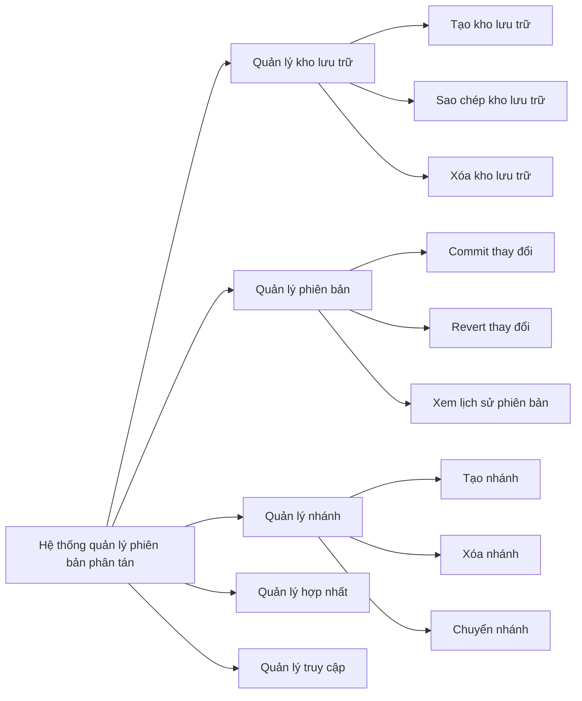
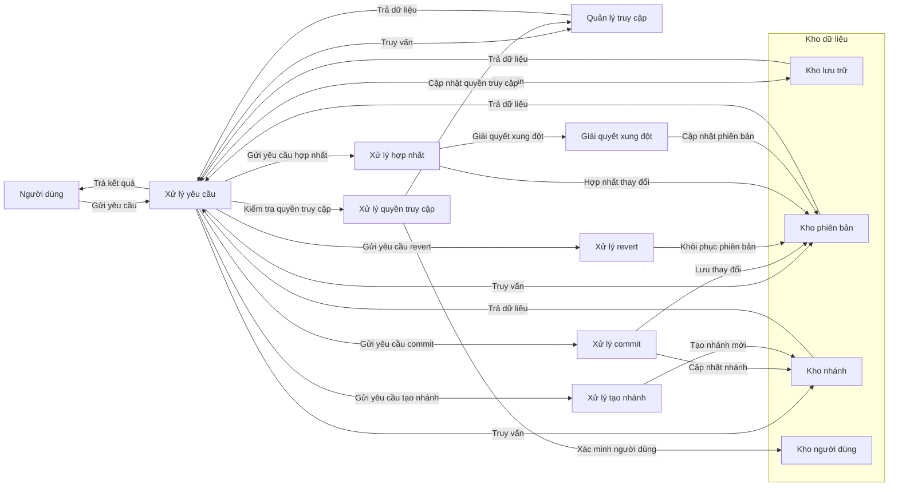
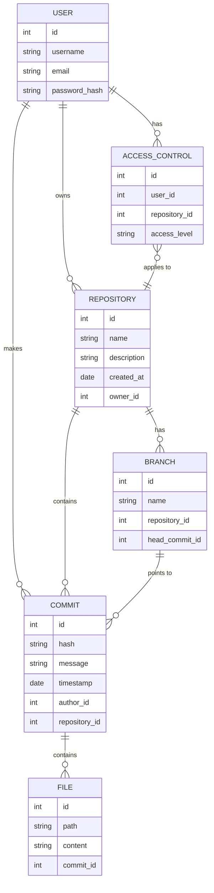

# Các mô hình của DVCS
## Mô hình phân cấp chức năng
```
graph LR
    A[Hệ thống quản lý phiên bản phân tán] --> B[Quản lý kho lưu trữ]
    A --> C[Quản lý phiên bản]
    A --> D[Quản lý nhánh]
    A --> E[Quản lý hợp nhất]
    A --> F[Quản lý truy cập]

    B --> B1[Tạo kho lưu trữ]
    B --> B2[Sao chép kho lưu trữ]
    B --> B3[Xóa kho lưu trữ]

    C --> C1[Commit thay đổi]
    C --> C2[Revert thay đổi]
    C --> C3[Xem lịch sử phiên bản]

    D --> D1[Tạo nhánh]
    D --> D2[Xóa nhánh]
    D --> D3[Chuyển nhánh]

    E --> E1[Hợp nhất nhánh]
    E --> E2[Giải quyết xung đột]

    F --> F1[Quản lý người dùng]
    F --> F2[Quản lý quyền truy cập]

```

### Giải thích
Nút gốc A đại diện cho hệ thống quản lý phiên bản phân tán.

Các nút con như B, C, D, E, F đại diện cho các chức năng chính của hệ thống:

B: Quản lý kho lưu trữ, bao gồm các hoạt động tạo, sao chép và xóa kho lưu trữ.

C: Quản lý phiên bản, bao gồm các hoạt động commit, revert và xem lịch sử phiên bản.

D: Quản lý nhánh, bao gồm các hoạt động tạo, xóa và chuyển nhánh.

E: Quản lý hợp nhất, bao gồm hợp nhất nhánh và giải quyết xung đột.

F: Quản lý truy cập, bao gồm quản lý người dùng và quyền truy cập.

## Mô hình dòng dữ liệu
```
graph LR
    %% Các thành phần chính
    User[Người dùng] -->|Gửi yêu cầu| ProcessRequest[Xử lý yêu cầu]
    ProcessRequest -->|Truy vấn| RepoDatabase[Kho lưu trữ]
    ProcessRequest -->|Truy vấn| VersionDatabase[Kho phiên bản]
    ProcessRequest -->|Truy vấn| BranchDatabase[Kho nhánh]
    ProcessRequest -->|Truy vấn| AccessControl[Quản lý truy cập]
    RepoDatabase -->|Trả dữ liệu| ProcessRequest
    VersionDatabase -->|Trả dữ liệu| ProcessRequest
    BranchDatabase -->|Trả dữ liệu| ProcessRequest
    AccessControl -->|Trả dữ liệu| ProcessRequest
    ProcessRequest -->|Trả kết quả| User

    %% Xử lý các yêu cầu từ người dùng
    ProcessRequest -->|Gửi yêu cầu commit| CommitProcessor[Xử lý commit]
    CommitProcessor -->|Lưu thay đổi| VersionDatabase
    CommitProcessor -->|Cập nhật nhánh| BranchDatabase

    ProcessRequest -->|Gửi yêu cầu revert| RevertProcessor[Xử lý revert]
    RevertProcessor -->|Khôi phục phiên bản| VersionDatabase

    ProcessRequest -->|Gửi yêu cầu tạo nhánh| BranchProcessor[Xử lý tạo nhánh]
    BranchProcessor -->|Tạo nhánh mới| BranchDatabase

    ProcessRequest -->|Gửi yêu cầu hợp nhất| MergeProcessor[Xử lý hợp nhất]
    MergeProcessor -->|Hợp nhất thay đổi| VersionDatabase
    MergeProcessor -->|Giải quyết xung đột| ConflictResolver[Giải quyết xung đột]
    ConflictResolver -->|Cập nhật phiên bản| VersionDatabase

    %% Xử lý quản lý truy cập
    ProcessRequest -->|Kiểm tra quyền truy cập| AccessControlProcessor[Xử lý quyền truy cập]
    AccessControlProcessor -->|Xác minh người dùng| UserDatabase[Kho người dùng]
    AccessControlProcessor -->|Cập nhật quyền truy cập| AccessControl

    %% Các kho dữ liệu
    subgraph Databases [Kho dữ liệu]
        RepoDatabase
        VersionDatabase
        BranchDatabase
        UserDatabase
    end
```

### Giải thích
User: Người dùng gửi yêu cầu đến hệ thống.

ProcessRequest: Xử lý các yêu cầu từ người dùng và chuyển đến các xử lý cụ thể.

RepoDatabase, VersionDatabase, BranchDatabase, UserDatabase: Các kho dữ liệu của hệ thống.

CommitProcessor, RevertProcessor, BranchProcessor, MergeProcessor, ConflictResolver, AccessControlProcessor: Các thành phần xử lý cụ thể cho các yêu cầu khác nhau.

AccessControl: Quản lý quyền truy cập của người dùng.

Các mũi tên thể hiện dòng dữ liệu giữa các thành phần của hệ thống.

## Mô hình thực thể kết hợp
```
erDiagram
    USER {
        int id
        string username
        string email
        string password_hash
    }

    REPOSITORY {
        int id
        string name
        string description
        date created_at
        int owner_id
    }

    BRANCH {
        int id
        string name
        int repository_id
        int head_commit_id
    }

    COMMIT {
        int id
        string hash
        string message
        date timestamp
        int author_id
        int repository_id
    }

    FILE {
        int id
        string path
        string content
        int commit_id
    }

    ACCESS_CONTROL {
        int id
        int user_id
        int repository_id
        string access_level
    }

    %% Các mối kết hợp giữa các thực thể
    USER ||--o{ REPOSITORY : "owns"
    USER ||--o{ COMMIT : "makes"
    USER ||--o{ ACCESS_CONTROL : "has"

    REPOSITORY ||--o{ BRANCH : "has"
    REPOSITORY ||--o{ COMMIT : "contains"

    BRANCH ||--o{ COMMIT : "points to"

    COMMIT ||--o{ FILE : "contains"

    ACCESS_CONTROL }o--|| REPOSITORY : "applies to"
```

### Giải thích
USER: Thực thể đại diện cho người dùng với các thuộc tính như id, username, email, và password_hash.

REPOSITORY: Thực thể đại diện cho kho lưu trữ với các thuộc tính như id, name, description, created_at, và owner_id.

BRANCH: Thực thể đại diện cho nhánh với các thuộc tính như id, name, repository_id, và head_commit_id.

COMMIT: Thực thể đại diện cho phiên bản commit với các thuộc tính như id, hash, message, timestamp, author_id, và repository_id.

FILE: Thực thể đại diện cho tệp tin với các thuộc tính như id, path, content, và commit_id.

ACCESS_CONTROL: Thực thể đại diện cho quyền truy cập với các thuộc tính như id, user_id, repository_id, và access_level.
### Các mối kết hợp
Người dùng (USER) sở hữu nhiều kho lưu trữ (REPOSITORY).

Người dùng (USER) thực hiện nhiều phiên bản commit (COMMIT).

Người dùng (USER) có nhiều quyền truy cập (ACCESS_CONTROL).

Kho lưu trữ (REPOSITORY) có nhiều nhánh (BRANCH).

Kho lưu trữ (REPOSITORY) chứa nhiều phiên bản commit (COMMIT).

Nhánh (BRANCH) trỏ đến nhiều phiên bản commit (COMMIT).

Phiên bản commit (COMMIT) chứa nhiều tệp tin (FILE).

Quyền truy cập (ACCESS_CONTROL) áp dụng cho nhiều kho lưu trữ (REPOSITORY).
